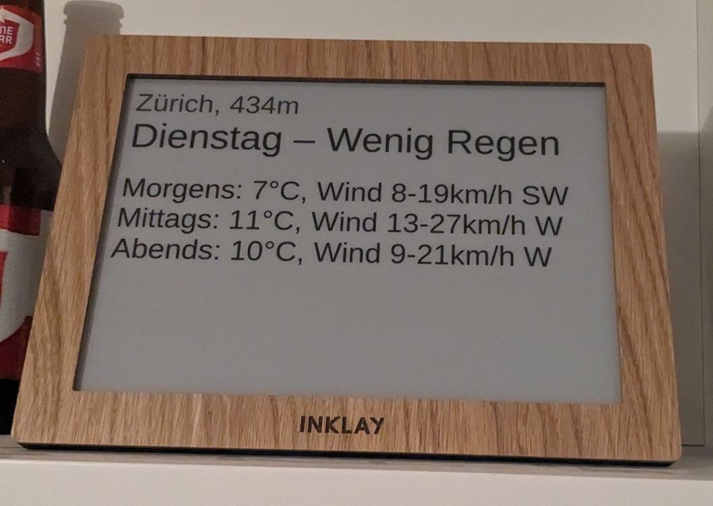

# Weather displays for [Inklay](https://www.inklay.app/)

[](meteosuisse/demo.jpg)

The [low-effort/](low-effort) ones are just static HTML files you can put onto any web hosting.

The [meteosuisse/](meteosuisse/) one is slightly more sophisticated - it requires a proxy to overcome the https://www.meteoschweiz.admin.ch/ CORS restrictions.
The proxy is implemented as a simple PHP script which you can put alongside the static HTML.
It is secured via a secret URL token.

## Development

You have to change `SECRET_TOKEN_HASH` in `proxy.php` to the bcrypt hash of some new random value,
and then pass this value to text.html as `proxySecretToken` URL param.

```bash
cd meteosuisse
sudo apt-get install php-cli php8.1-curl
php -S localhost:8000

# To format
prettier -w *.html
```

Now, open <http://localhost:8000/text.html?zipcode=...&?proxySecretToken=...> in your browser.
